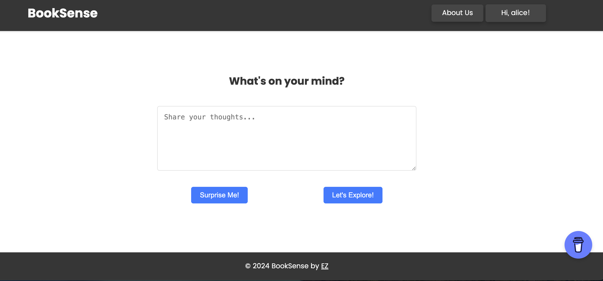

# BookSense — Personalized Book Discovery

## Overview

The **BookSense — Books That Know You** is an intelligent web-based application that delivers personalized book recommendations based on user inputs. This project integrates AI-driven natural language processing (NLP) models to provide an enhanced recommendation experience for readers, beyond traditional approaches.

**Key Features:**
- **User-Friendly Interface:** Easy-to-navigate front-end for seamless interaction.
- **Secure User Authentication:** Safe Robust registration and login functionality to protect user data.
- **Personalized Book Recommendations:** Advanced recommendation engine that analyzes user input to suggest books based on nuanced themes, genres, and preferences.

---

## Problem

Readers often struggle to find books that match their specific preferences or mood, as many recommendation platforms are limited by:
- Reliance on bestseller lists
- Generic reviews that don’t consider the reader's unique tastes

**Challenges with Existing Platforms:**
- **Limited Personalization:** Platforms like Goodreads and Amazon often recommend books based on past purchases or user ratings, which may not reflect changing interests or nuanced preferences.
- **Lack of Nuanced Interpretation:** Current systems do not effectively process detailed textual input, such as the reader’s emotions, themes, or specific stylistic preferences.

**Example:**
- **Librarian.AI:** While it offers some level of personalization, its focus on genres and ratings doesn’t allow for deeper text analysis and interpretation.

**Proposed Solution:**
- **Advanced NLP Integration:** BookSense offers a unique solution by utilizing advanced NLP techniques to interpret user inputs more deeply, ensuring recommendations are tailored to the reader’s specific needs.

---

## NLP Model in Use

**Keyword Extraction vs. Text Summarization**

**Keyword Extraction:**
- **Pros:**
  - **Specificity:** Identifies relevant topics, genres, and specific keywords from user inputs.
  - **Precision:** Directly maps to specific books or categories.
  - **Simplicity:** Easier to implement and understand.
- **Cons:**
  - **Context Loss:** May miss broader context in long or complex inputs.
  - **Limited Insight:** Might not always capture nuanced reader preferences.

**Text Summarization:**
- **Pros:**
  - **Context Preservation:** Captures the main ideas and broader context from longer user inputs.
  - **Enhanced Understanding:** Provides richer insights into user preferences for better recommendations.
- **Cons:**
  - **Complexity:** More complex and computationally intensive.
  - **Over-Simplification:** Potentially misses key specifics in shorter inputs.

**Choosing the Right Approach:**
- **Short Inputs:** Use keyword extraction for quick and precise identification on precise gernres, themes.
- **Long Inputs:** Use text summarization to capture main ideas and nuances.

**Hybrid Approach:**
- **Initial Analysis:** Apply keyword extraction for key themes.
- **Contextual Understanding:** Use text summarization for broader context.
- **Combined Insights:** Integrate both methods for comprehensive recommendations.

---

## How to Use the Web App

**Sign Up/Log In:** Register with an email and password or log in to access personalized recommendations.

**Input Words or Sentences:** Enter whatever you want to say, such as favorite genres, mood, or desired themes, using simple or detailed text inputs.

**Get Recommendations:** The search engine processes the input using NLP models to generate a list of recommended books tailored to each user's tastes.

**Add to Wishlist:** Save books to the wishlist for later reference.

---
